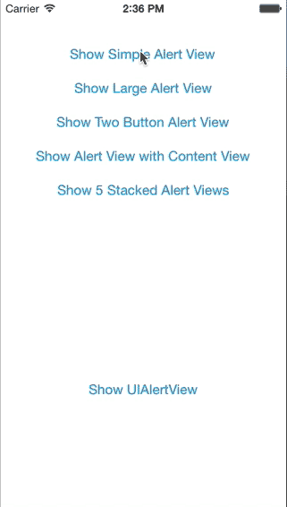

# PXAlertView

PXAlertView is a UIAlertView replacement similar to the style in iOS 7 but with a block based API and the ability to customise the styling and add custom views.

## Preview


## Features

* Simple block syntax instead of delegates
* Animations that match UIAlertView in iOS 7
* Fully customisable
* Add your own UIView beneath the title

## Installation

Add the following to your [CocoaPods](http://cocoapods.org/) Podfile

	pod 'PXAlertView', '~> 0.1.0'

or clone as a git submodule,

or just copy ```PXAlertView.h``` and ```.m``` into your project.

## Usage

See [PXAlertView.h](Classes/PXAlertView.h) for the complete API.

### An Example

```Objective-C
[PXAlertView showAlertWithTitle:@"The Matrix"
                        message:@"Pick the Red pill, or the blue pill"
                    cancelTitle:@"Blue"
                     otherTitle:@"Red"
                     completion:^(BOOL cancelled, NSInteger buttonIndex) {
                         if (cancelled) {
                             NSLog(@"Cancel (Blue) button pressed");
                         } else {
                             NSLog(@"Other (Red) button pressed");
                         }
                     }];
```

## TODO

* Add style that matches iOS 7 exactly
* Ability to dynamically specify the styling of AlertView: default/dark
* Allow usage using the same API methods as UIAlertView and delegate.

## License

PXAlertView is available under the MIT license. See the LICENSE file for more info.